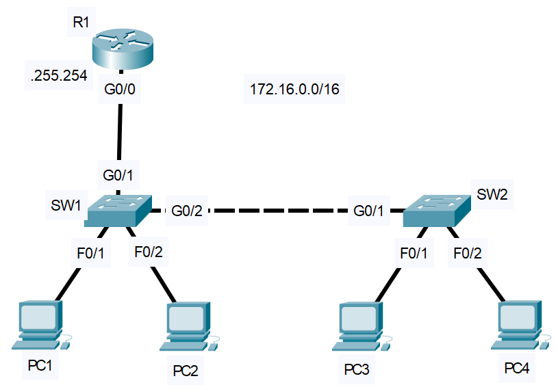

# Basic Interface Configuration
- Exam Topic 1.6 - **"Configure and verify IPv4 addressing and subnetting"**
- [📄 View Full Lab (PDF)](./Basic_Interface_Configuration.pdf)

## Scenario
  You are administering a small office network. The network devices are newly deployed and require basic configuration, including hostnames, IP addressing, and interface descriptions. For security, all unused switch interfaces must be disabled.

  One of the PCs (PC4) is a legacy device with a network interface that is hard-coded for 10 Mbps half-duplex and does not support auto-negotiation. This results in a speed and duplex mismatch with the connected switchport, causing degraded network performance. The switch interface must be manually configured to match the device’s settings.

## Requirements
- Configure hostnames for each network device
- Configure IP address on R1 G0/0 to serve as the default gateway for the network
- Configure descriptions on all interfaces connected to devices
- Configure SW2 F0/2 to match speed and duplex of connected legacy device (10, half)
- Administratively disable all unused switch ports

## Post-Lab Testing
- Perform connectivity tests by pinging between PCs across switches.
- Verify all interfaces are up and correctly configured.
- Confirm the speed and duplex setting on SW2 F0/2 matches the legacy device.

 
  
