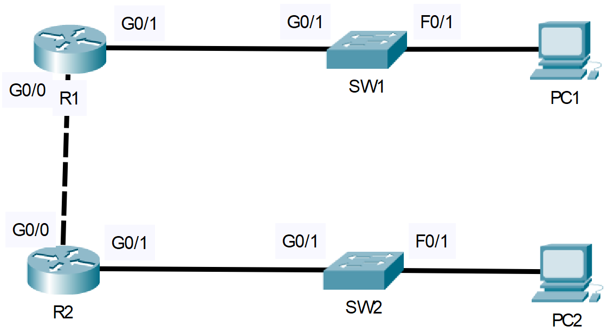

# CDP and LLDP - Cisco Discovery Protocol and Link Local Discovery Protocol
- Exam Topic 2.3 - **"Configure and verify Layer 2 discovery protocols (CDP and LLDP)"**
- [📄 View Full Lab (PDF)](./CDP-and-LLDP.pdf)

## Scenario
You are administering two running networks together through a single point-to-point link. All
network devices are Cisco proprietary except for SW2. You wish to take advantage of layer 2 discovery
protocols to obtain information about device neighbors.

Finally, all network devices should be configured to take advantage of a common layer 2 discovery
protocol.

## Requirements
- Demonstrate ability to view layer 2 discovery information via the CLI
- Disable CDP on all network devices that are using it, both globally and on the interface level
- Enable LLDP on all network devices, both globally and on the interface level

## Post-Lab Testing
- Use appropriate ‘show’ commands to confirm exchange of layer 2 information

 
  
