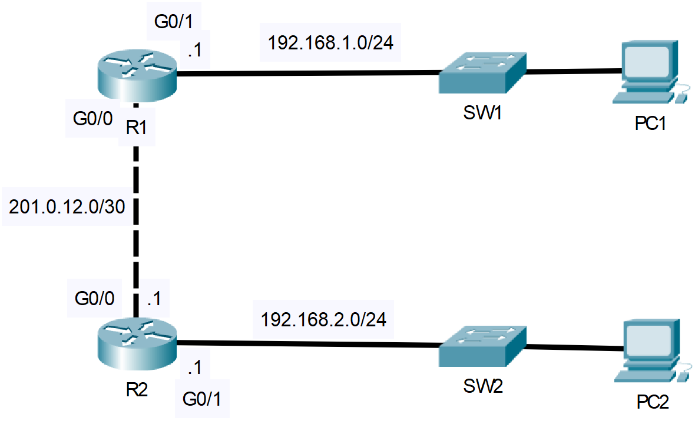

# DHCP
- Exam Topic 4.6 - **"Configure and verify DHCP client and relay"**
- [📄 View Full Lab (PDF)](./DHCP.pdf)

## Scenario
A company has two client subnets (192.168.1.0/24 and 192.168.2.0/24) and a point-to-point link
(201.0.12.0/30) between routers R1 and R2. R2 is to act as the central DHCP server that provides IP
addresses, default gateways, DNS servers, and domain names to clients on these networks.

DHCP will be intentionally configured on a /30 link for educational purposes. In production, point-
to-point links are statically addressed.

## Requirements
- Configure DHCP pools and reservations for both client networks and the point-to-point link
- Configure R1 G0/0 as a DHCP client
- Configure R1 as a DHCP relay-agent for the 192.168.1.0/24 network
- Have PCs obtain IP addresses, DNS addresses, domain names and default gateways from the
DHCP server using CLI commands

## Post-Lab Testing
- Confirm DHCP client auto-configurations using appropriate ‘show’ commands/command prompt
inputs
- Perform connectivity tests by pinging between PCs across switches

 
  
