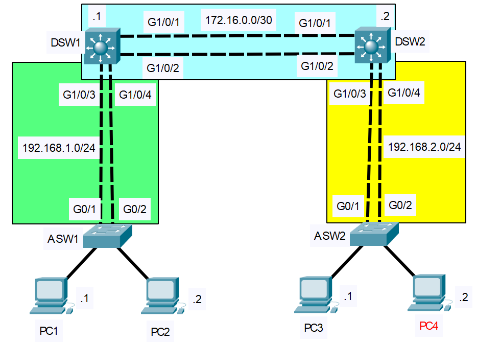

# EtherChannel
- Exam Topic 2.4 - **"Configure and verify (Layer 2/Layer 3) EtherChannel (LACP)"**
- [📄 View Full Lab (PDF)](./EtherChannel.pdf)

## Scenario
A company wants to increase bandwidth between their distribution and access switches, and is exploring link aggregation methods with load balancing. One access switch does not support Cisco proprietary protocols, requiring the use of LACP for compatibility. The company would like to stick with Cisco proprietary protocols wherever possible.  

## Requirements
- Establish EtherChannel among switch connections
- Layer 3 EtherChannel to be used for links between distribution switches
- Layer 2 EtherChannel to be used for links between access switches and distribution switches
- Cisco proprietary protocols should be used where supported. For devices that do not support Cisco protocols, LACP must be used.
- Load balancing should be set to use source/destination MAC addresses.

## Post-Lab Testing
- Use appropriate ‘show’ commands to confirm operation
- Ping PCs across EtherChannel links

 
  
