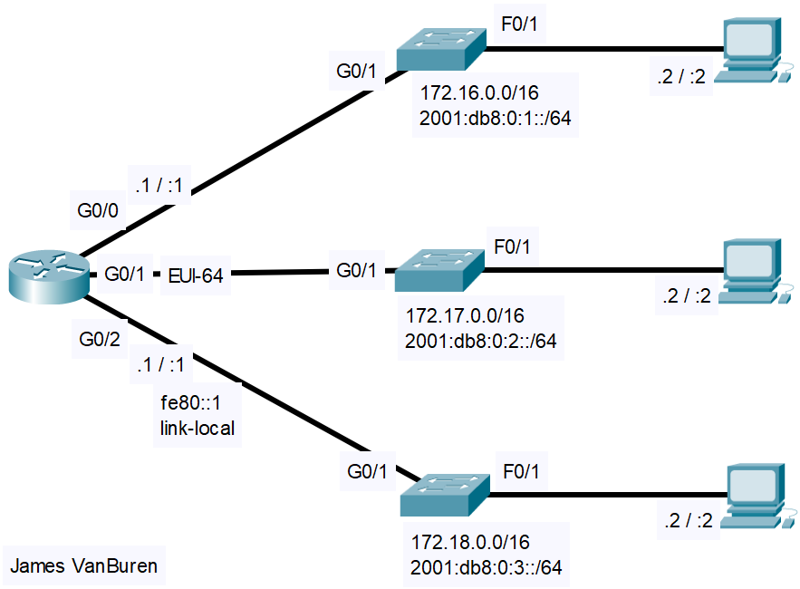

# IPv6 Interface Configuration
- Exam Topic 1.8 - **"Configure and verify IPv6 addressing and prefix"**
- [📄 View Full Lab (PDF)](./IPv6_Interface_Configuration.pdf)

## Scenario
A company wishes to transition from using IPv4 to using IPv6 on their network devices with the intention to eventually transition to using IPv6 exclusively.  It is important that existing operational configurations remain intact to ensure availability until then.

## Requirements
- Enable IPv6 routing
- Configure appropriate IPv6 addresses on router using manual configuration, EUI-64, and Link-local addressing
- Configure appropriate IPv6 addresses and default gateways on PCs

## Post-Lab Testing
- Perform connectivity tests by pinging between PCs across subnets with both IPv4 and IPv6
- Run appropriate ‘show’ commands to confirm configuration

 
  
