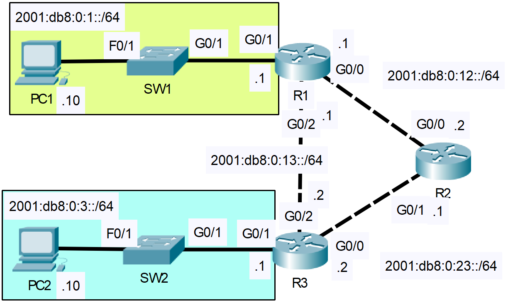

# IPv6 Static Routing
- Exam Topic 3.3 - **"Configure and verify IPv4 and IPv6 static routing"**
- [📄 View Full Lab (PDF)](./IPv6_Static_Routing.pdf)

## Scenario
A company has a user network on the branch floor (SW1) and a server network in the data center (SW2), and both need to communicate through the internal routing infrastructure using IPv6. Under normal conditions, traffic is expected to follow the main path through R2, which acts as the central router connecting the two sides. There is also a direct link between R1 and R3, but it exists only as a backup and should not be used unless the primary path fails. 

The network does not use dynamic routing, so everything must be handled with IPv6 static routes. Your task is to configure routing on R1, R2, and R3 so that communication between the two networks works reliably, traffic prefers the path through R2, and automatically switches to the R1–R3 link if the main path goes down.

## Requirements
- Enable IPv6 routing on routers
- Manually configure IPv6 addresses for all connected router interfaces
- Configure IPv6 addresses on PCs
- Configure the necessary IPv6 static routes for inter-office communications
- Configure the backup link route accordingly, allowing for automatic switch-over if the main path fails

## Post-Lab Testing
- Perform connectivity tests by pinging between PCs across switches
- Disable interfaces on primary route to test backup route switchover
- Run the appropriate ‘show’ commands to confirm configuration

 
 
  
