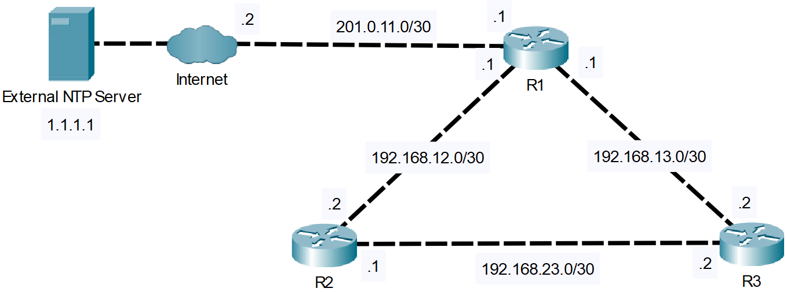

# EtherChannel
- Exam Topic 4.2 - **"Configure and verify NTP operating in a client and server mode"**
- [📄 View Full Lab (PDF)](./NTP.pdf)

## Scenario
You are tasked with configuring time and dates on a network’s routers. Ultimately, all routers
should pull their date and time configurations from a trustworthy external source, while having an internal
backup should the external server become unavailable. 

## Requirements
- Configure R1 to synchronize with the external NTP server
- Configure R1 as an NTP master with the external NTP server having priority
- Configure R2 and R3 to synchronize using authentication
- Configure NTP to update hardware calendars of all 3 routers

## Post-Lab Testing
- Run appropriate ‘show’ commands to confirm synchronization among all devices

 
  
