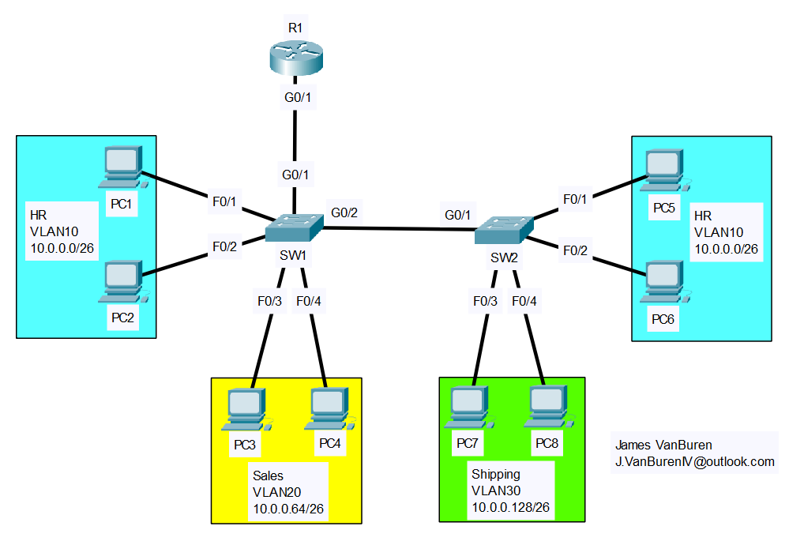

# VLANs and Trunking
- Exam Topic 2.1 - **"Configure and verify VLANs (normal range) spanning multiple switches"**
- Exam Topic 2.2 - **"Configure and verify interswitch connectivity"**
- [📄 View Full Lab (PDF)](./VLANs_and_Trunking.pdf)

## Scenario
A small company wants to separate departments into different VLANs for security and broadcast control.  Devices in each department must communicate through a Layer-3 gateway, with internet access provided through the edge router.

## Requirements
- Switch interfaces connected to PCs need to be configured to their appropriate VLANs
- Inter-VLAN routing must work; trunking must carry all necessary VLANs
- Unused switch ports must be disabled for security

## Post-Lab Testing
- Perform pings on PCs between other PCs on the same and different VLANs
- Run appropriate ‘show’ commands to confirm configuration

 
  
